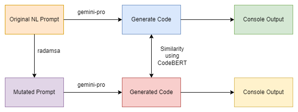

# Case Study: Gemini-Pro

This repository contains the case study on Gemini-Pro. The workflow we have proposed is:
  
In this research, we have used the LLMSecEval dataset and used the 150 NL Prompts in it to generate code using gemini-pro. We then used _radamsa_ to mutate all 150 prompts. About 26 mutation options were passed in the _-m_ argument. These options were:  
| Command | Description                     |
|---------|---------------------------------|
| bd      | Drop a byte                     |
| bf      | Flip one bit                    |
| bi      | Insert a random byte            |
| br      | Repeat a byte                   |
| bp      | Permute some bytes              |
| bei     | Increment a byte by one         |
| bed     | Decrement a byte by one         |
| ber     | Swap a byte with a random one   |
| sr      | Repeat a sequence of bytes      |
| sd      | Delete a sequence of bytes      |
| lr2     | Duplicate a line                |
| li      | Copy a line closeby             |
| ls      | Swap two lines                  |
| lp      | Swap order of lines             |
| lis     | Insert a line from elsewhere    |
| lrs     | Replace a line with one from elsewhere |
| td      | Delete a node                   |
| tr2     | Duplicate a node                |
| ts1     | Swap one node with another one  |
| ts2     | Swap two nodes pairwise         |
| tr      | Repeat a path of the parse tree |
| uw      | Try to make a code point too wide |
| num     | Insert funny Unicode            |
| ft      | Jump to a similar position in block |
| fn      | Likely clone data between similar positions |
| fo      | Fuse previously seen data elsewhere |

We then used gemini-pro to again generate code for all the mutated prompts. Lastly, we calculated the similarity score using codeBERT between the code generated from original prompt and the codes generated from mutated prompts.  

### Files
1. [_LLMSecEval_](https://github.com/tuhh-softsec/LLMSecEval/): This is the dataset we have refered for the 150 original NL Prompts.  
2. _mutated_prompts.csv_: Contains the results of the mutated codes.   
3. _gen_code.csv_: Contains the code generated from the original 150 prompts.   
4. _mutated_prompts_gen_code.csv_: Contains the code generated for each of the mutated prompts.   
4. _main_sim.py_: Contains the results of the similarity scores calculated between the code generated from original prompt to the corresponding codes generated from mutated prompts.   
